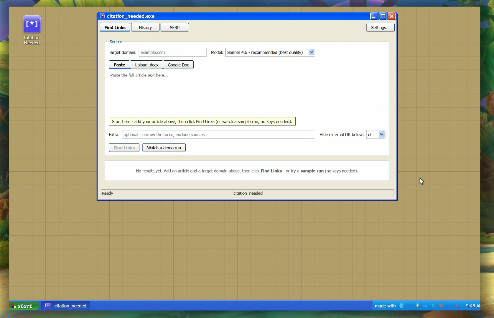
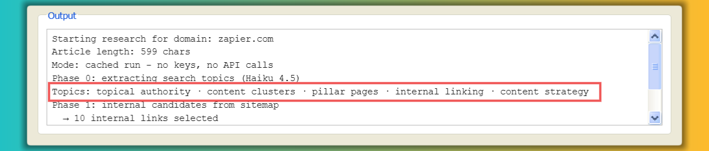
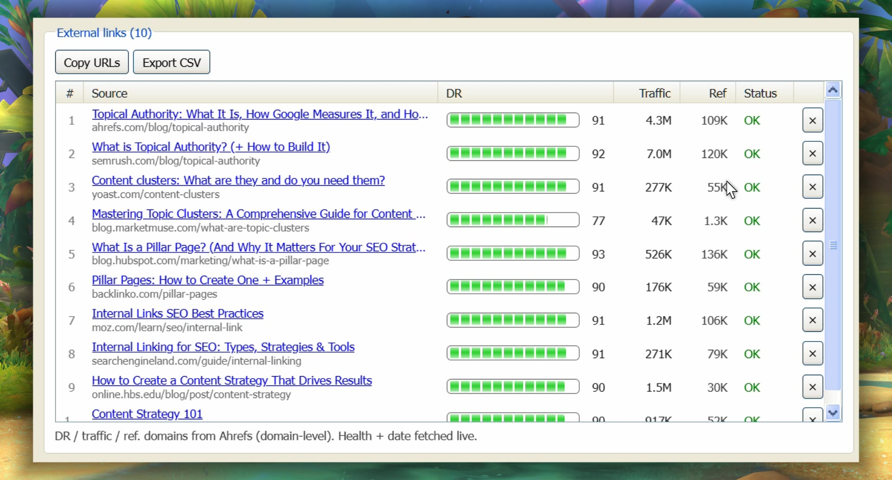
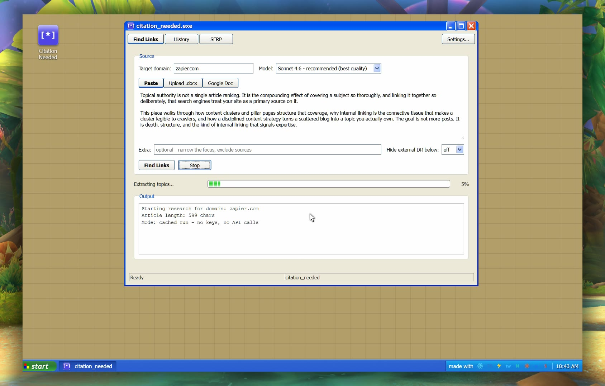
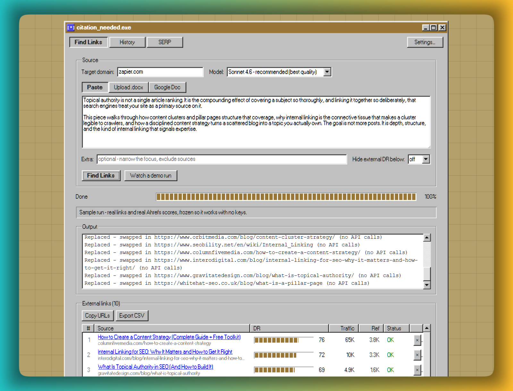
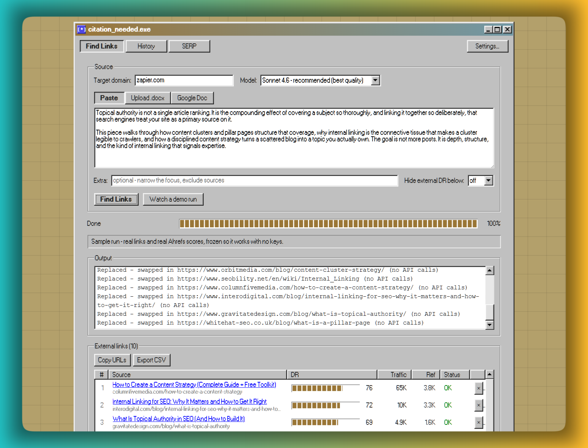
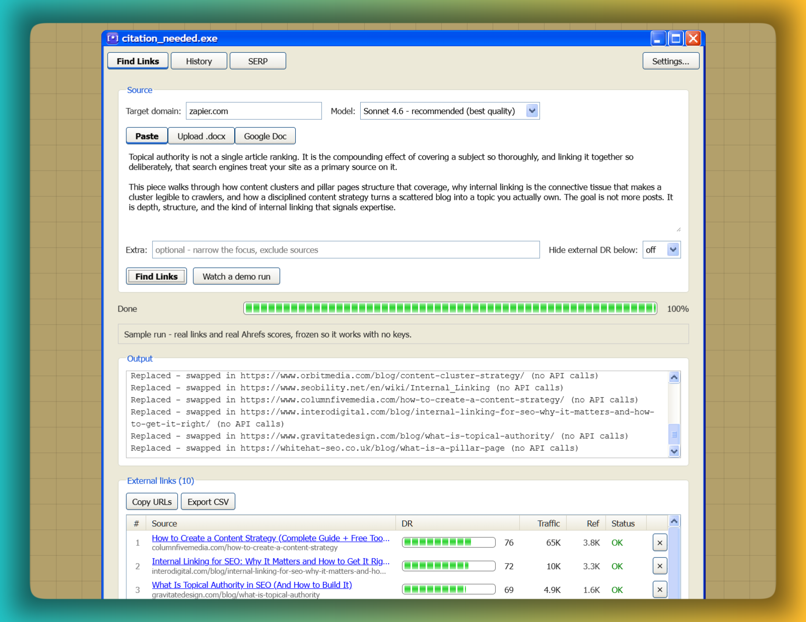
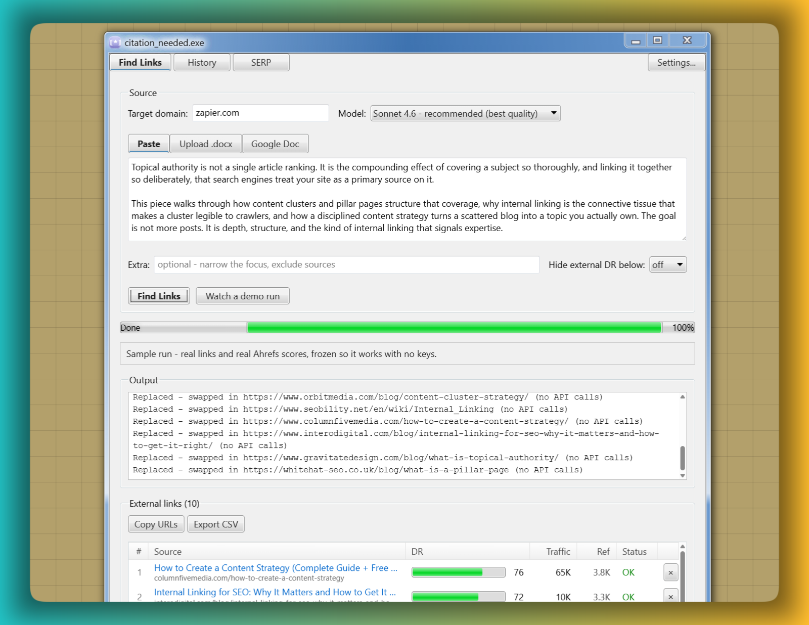

# Citation Needed `[*]`

Paste an article and a target domain. Get vetted internal and external links to cite, scored with real authority data, with every number labeled by where it came from.

Built by an editor who spent a decade doing this by hand and finally got tired of it. The full build story is at [reljabojovic.com/citation-needed](https://reljabojovic.com/citation-needed).

[](media/demo.mp4)

*Click through for the full demo run. Yes, that is Windows 95. We'll get to that.*

## What it does

It encodes the checklist an experienced outreach editor applies by hand: pull the article's topics apart, search each one separately (so results stay diverse), keep internal links to real article pages, keep external links to unique, authoritative domains, and gate on recency. Then it adds the thing that checklist can't do in your head at scale: real authority scoring.

- **External links, scored.** Each candidate gets its Ahrefs **Domain Rating**, organic **traffic**, and **referring domains**, in sortable columns, with an optional "hide anything under DR _N_" floor. Sort by what matters instead of trusting Google's order.
- **Internal links from the sitemap.** Pulls the target site's own sitemap and matches pages to the article's topics, instead of guessing through a `site:` search. Falls back to search when a site has no usable sitemap.
- **A SERP view.** Type a keyword, see who ranks and how strong each result is. The organic rows double as authority-vetted citation candidates.
- **Link health.** Every link is probed (a real GET, never HEAD, so bot-walls don't produce false 404s). Dead links never make the list; bot-protected pages are flagged "could not verify," not "dead."
- **Reject and replace.** Don't like a link? Click × and it instantly swaps in the next-best candidate from the pool it already gathered.
- **Saved history** of past runs, and a **safe demo mode** that replays a real, frozen run with no keys.
- **Honesty rule.** Every metric shows its source. The tool never fabricates a number it can't measure.

## Five nets beat one big trawl

The core trick is almost stupidly simple once you see it. An article is just topics and subtopics, and each subtopic fishes a totally different patch of the search results. One greedy mega-query lets Google clump the same 10 overlapping pages at the top; 5 separate topic searches each pull from their own pool, so the candidates stay diverse.



*One article, five searches. Each box is its own pool of candidates.*

The judgment stays human on purpose. There is no LLM that can replace an editor deciding whether a link actually belongs in a sentence - so the tool automates the boring research and leaves the judging where it belongs. That's also why it will never auto-insert links into your draft: I tried, the results read like machine-woven carpet, and the feature died.

[](media/replace.mp4)

*Switching links out for cached alternatives - the next-best candidate slides in, no re-run.*

## What a run costs

The status bar shows the live cost of every run and which model spent it. Estimated for a ~1,500-word article with a ~100-candidate external pool (internal links come free from the sitemap):

| | | 1 run | 1,000 runs |
|---|---|---|---|
| SerpAPI | 5 searches @ $0.025 | $0.125 | $125 |
| Haiku 4.5 | topic extraction | ~$0.003 | ~$3 |
| Sonnet 4.6 | ranks 2 pools | ~$0.044 | ~$44 |

The search cost is the floor - the AI work is pennies.

## Why does a link tool cosplay as Windows 95?

Partly homage. Mostly my own take on accessibility: familiarity. We all carry the same muscle memory for these iconic, slightly clunky old UIs - you already know how a window, a tab and a Start menu behave, so there's nothing new to learn. The progress bars that tick across the screen while topics resolve are stolen straight from the Windows 7 task manager, because those dumb-simple visual signals were exactly what the job needed.

[](media/progress.mp4)

There's an upgrade path in Settings: Windows 95, 98, XP or 7, with the original Display Properties color schemes (Rainy day, Spruce, Eggplant). Nostalgia comes in different flavors, and I don't discriminate. Except Vista.

| | |
|---|---|
|  |  |
|  |  |

## Stack

React 19 + Vite + TypeScript + Tailwind, with serverless functions (Netlify) that proxy the upstream APIs so keys never sit in the browser's network calls. Retro chrome courtesy of 98.css, XP.css and 7.css. No accounts, no database - run history lives in your browser.

## Running it

```bash
npm install
npm run dev          # front end only - enough for the demo
```

The **demo** ("Watch a demo run") works with no keys and no network calls.

For **live runs** you need the serverless proxies, so run it through Netlify:

```bash
npm run netlify      # netlify dev - front end + functions
```

Then add your keys under **Settings** (gear, top right):

- **Anthropic** - required. Topic extraction (Haiku) and link ranking (Sonnet).
- **SerpAPI** - optional. Higher-quality Google candidates; without it the tool uses Claude's web search.
- **Ahrefs** - optional. Unlocks the DR / traffic columns and the live SERP view.

Keys are stored only in your browser and forwarded per-request to each provider; they are never persisted server-side.

## Build

```bash
npm run build        # tsc + vite, output in dist/
```

Deploys as a static site plus the `netlify/` functions.
